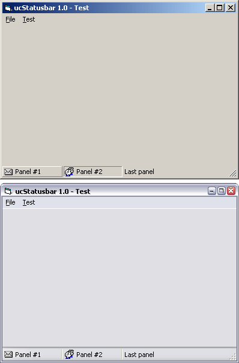



## API\-ucStatusbar 1\.0

### Description

Status bar API-UserControl.
 
### More Info
 

             |
---                |---
**Submitted On**   |2004-12-09 16:12:34
**By**             |[Carles P\.V\.](https://github.com/Planet-Source-Code/PSCIndex/blob/master/ByAuthor/carles-p-v.md)
**Level**          |Intermediate
**User Rating**    |5.0 (60 globes from 12 users)
**Compatibility**  |VB 6\.0
**Category**       |[Custom Controls/ Forms/  Menus](https://github.com/Planet-Source-Code/PSCIndex/blob/master/ByCategory/custom-controls-forms-menus__1-4.md)
**World**          |[Visual Basic](https://github.com/Planet-Source-Code/PSCIndex/blob/master/ByWorld/visual-basic.md)
**Archive File**   |[API\-ucStat1887965132005\.zip](https://github.com/Planet-Source-Code/carles-p-v-api-ucstatusbar-1-0__1-56837/archive/master.zip)

